# 3. DETAILED DESIGN (THIẾT KẾ CHI TIẾT HOÀN CHỈNH)

Tài liệu này hệ thống hóa toàn bộ thiết kế chi tiết các chức năng của hệ thống đặt sân bóng **FFZone**. Mỗi phần bao gồm **Mã PlantUML Class Diagram** (đầy đủ các lớp logic, repository, thực thể và các đường liên kết quan hệ theo chuẩn UML) và các **Sơ đồ trình tự (Sequence Diagrams) đồng bộ 100% với code thực tế**.

---

## 🔑 3.1. Authentication & Account Recovery (Xác Thực & Quên Mật Khẩu)
Quản lý đăng ký tài khoản, đăng nhập (mật khẩu local / Google OAuth2) trả về JWT Token, đăng xuất, và luồng khôi phục mật khẩu qua mã OTP in-memory.

### 3.1.1. Mã Vẽ Class Diagram (PlantUML)
*Copy đoạn mã này vào [PlantText](https://www.planttext.com/) để vẽ:*
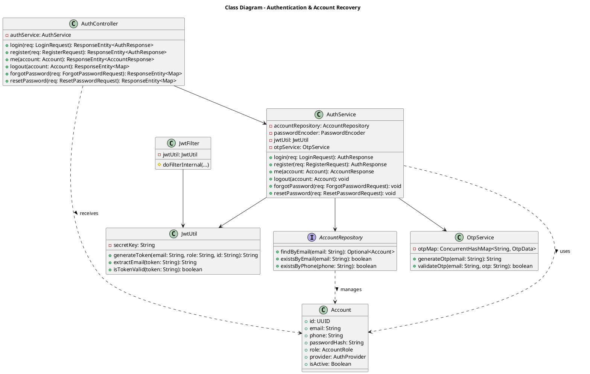
```plantuml
@startuml
title Class Diagram - Authentication & Account Recovery

class AuthController {
    - authService: AuthService
    + login(req: LoginRequest): ResponseEntity<AuthResponse>
    + register(req: RegisterRequest): ResponseEntity<AuthResponse>
    + me(account: Account): ResponseEntity<AccountResponse>
    + logout(account: Account): ResponseEntity<Map>
    + forgotPassword(req: ForgotPasswordRequest): ResponseEntity<Map>
    + resetPassword(req: ResetPasswordRequest): ResponseEntity<Map>
}

class AuthService {
    - accountRepository: AccountRepository
    - passwordEncoder: PasswordEncoder
    - jwtUtil: JwtUtil
    - otpService: OtpService
    + login(req: LoginRequest): AuthResponse
    + register(req: RegisterRequest): AuthResponse
    + me(account: Account): AccountResponse
    + logout(account: Account): void
    + forgotPassword(req: ForgotPasswordRequest): void
    + resetPassword(req: ResetPasswordRequest): void
}

class OtpService {
    - otpMap: ConcurrentHashMap<String, OtpData>
    + generateOtp(email: String): String
    + validateOtp(email: String, otp: String): boolean
}

class Account {
    + id: UUID
    + email: String
    + phone: String
    + passwordHash: String
    + role: AccountRole
    + provider: AuthProvider
    + isActive: Boolean
}

interface AccountRepository {
    + findByEmail(email: String): Optional<Account>
    + existsByEmail(email: String): boolean
    + existsByPhone(phone: String): boolean
}

class JwtUtil {
    - secretKey: String
    + generateToken(email: String, role: String, id: String): String
    + extractEmail(token: String): String
    + isTokenValid(token: String): boolean
}

class JwtFilter {
    - jwtUtil: JwtUtil
    # doFilterInternal(...)
}

AuthController --> AuthService
AuthService --> AccountRepository
AuthService --> JwtUtil
AuthService --> OtpService
JwtFilter --> JwtUtil

AccountRepository ..> Account : manages >
AuthService ..> Account : uses >
AuthController ..> Account : receives >
@enduml
```

### 3.1.2. Sequence Diagram: Register (Đăng Ký)
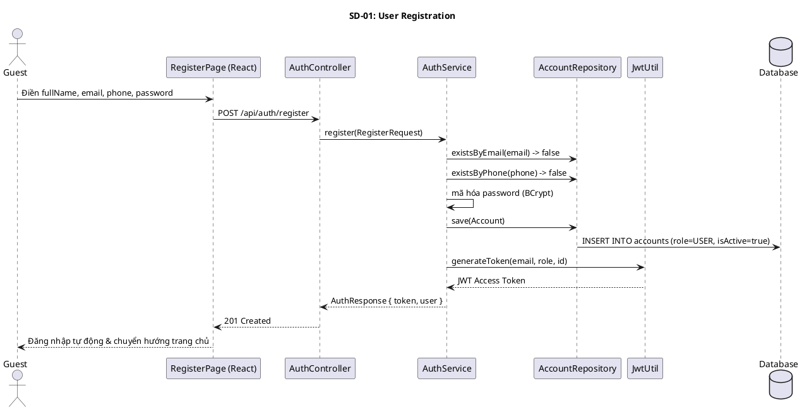
```plantuml
@startuml
title SD-01: User Registration
actor Guest
participant "RegisterPage (React)" as FE
participant AuthController as AC
participant AuthService as AS
participant AccountRepository as AR
participant JwtUtil as JWT
database Database as DB

Guest -> FE : Điền fullName, email, phone, password
FE -> AC : POST /api/auth/register
AC -> AS : register(RegisterRequest)
AS -> AR : existsByEmail(email) -> false
AS -> AR : existsByPhone(phone) -> false
AS -> AS : mã hóa password (BCrypt)
AS -> AR : save(Account)
AR -> DB : INSERT INTO accounts (role=USER, isActive=true)
AS -> JWT : generateToken(email, role, id)
JWT --> AS : JWT Access Token
AS --> AC : AuthResponse { token, user }
AC --> FE : 201 Created
FE --> Guest : Đăng nhập tự động & chuyển hướng trang chủ
@enduml
```

### 3.1.3. Sequence Diagram: Login (Đăng Nhập)
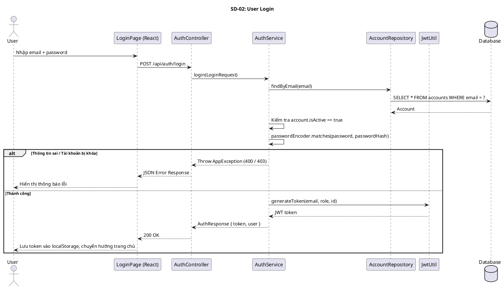
```plantuml
@startuml
title SD-02: User Login
actor User
participant "LoginPage (React)" as FE
participant AuthController as AC
participant AuthService as AS
participant AccountRepository as AR
participant JwtUtil as JWT
database Database as DB

User -> FE : Nhập email + password
FE -> AC : POST /api/auth/login
AC -> AS : login(LoginRequest)
AS -> AR : findByEmail(email)
AR -> DB : SELECT * FROM accounts WHERE email = ?
DB --> AR : Account
AS -> AS : Kiểm tra account.isActive == true
AS -> AS : passwordEncoder.matches(password, passwordHash)
alt Thông tin sai / Tài khoản bị khóa
  AS --> AC : Throw AppException (400 / 403)
  AC --> FE : JSON Error Response
  FE --> User : Hiển thị thông báo lỗi
else Thành công
  AS -> JWT : generateToken(email, role, id)
  JWT --> AS : JWT token
  AS --> AC : AuthResponse { token, user }
  AC --> FE : 200 OK
  FE --> User : Lưu token vào localStorage, chuyển hướng trang chủ
end
@enduml
```

---

## 🏟️ 3.2. Field Management (Quản Lý Sân Bóng & Khung Giờ)
Cho phép IT_Admin quản lý sân, biểu giá, sinh khung giờ trống tự động và cho phép khách hàng tra cứu lịch sân trống.

### 3.2.1. Mã Vẽ Class Diagram (PlantUML)
*Copy đoạn mã này vào [PlantText](https://www.planttext.com/) để vẽ:*
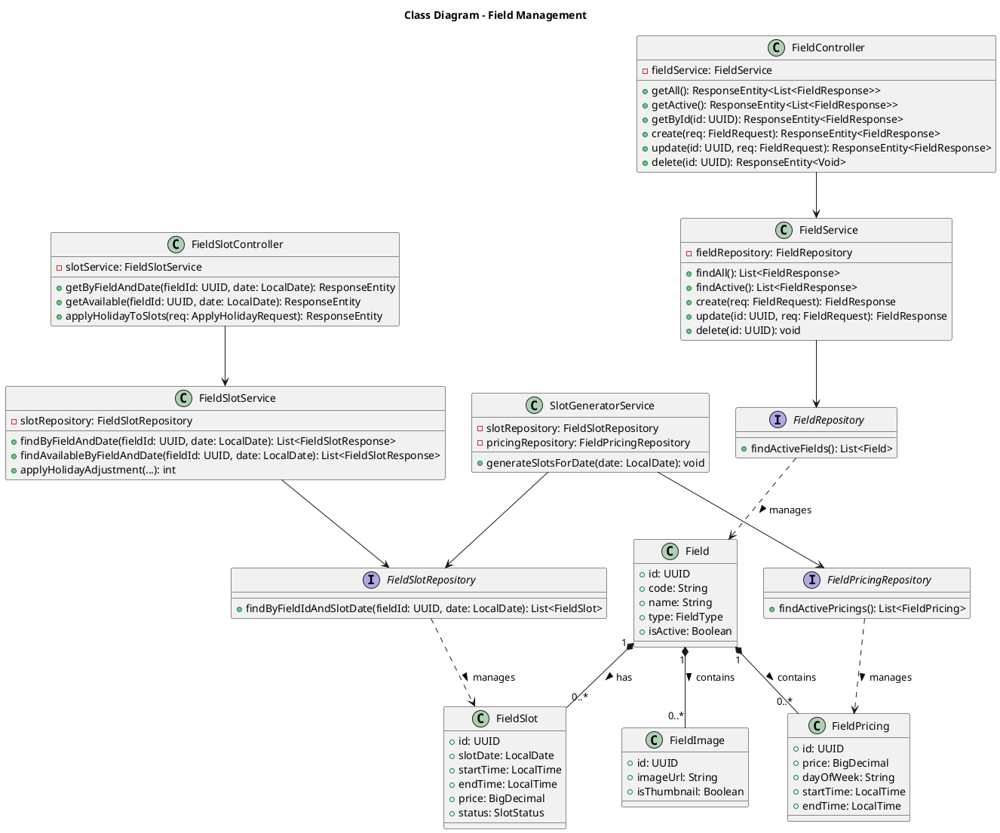
```plantuml
@startuml
title Class Diagram - Field Management

class FieldController {
    - fieldService: FieldService
    + getAll(): ResponseEntity<List<FieldResponse>>
    + getActive(): ResponseEntity<List<FieldResponse>>
    + getById(id: UUID): ResponseEntity<FieldResponse>
    + create(req: FieldRequest): ResponseEntity<FieldResponse>
    + update(id: UUID, req: FieldRequest): ResponseEntity<FieldResponse>
    + delete(id: UUID): ResponseEntity<Void>
}

class FieldSlotController {
    - slotService: FieldSlotService
    + getByFieldAndDate(fieldId: UUID, date: LocalDate): ResponseEntity
    + getAvailable(fieldId: UUID, date: LocalDate): ResponseEntity
    + applyHolidayToSlots(req: ApplyHolidayRequest): ResponseEntity
}

class FieldService {
    - fieldRepository: FieldRepository
    + findAll(): List<FieldResponse>
    + findActive(): List<FieldResponse>
    + create(req: FieldRequest): FieldResponse
    + update(id: UUID, req: FieldRequest): FieldResponse
    + delete(id: UUID): void
}

class FieldSlotService {
    - slotRepository: FieldSlotRepository
    + findByFieldAndDate(fieldId: UUID, date: LocalDate): List<FieldSlotResponse>
    + findAvailableByFieldAndDate(fieldId: UUID, date: LocalDate): List<FieldSlotResponse>
    + applyHolidayAdjustment(...): int
}

class SlotGeneratorService {
    - slotRepository: FieldSlotRepository
    - pricingRepository: FieldPricingRepository
    + generateSlotsForDate(date: LocalDate): void
}

interface FieldRepository {
    + findActiveFields(): List<Field>
}

interface FieldSlotRepository {
    + findByFieldIdAndSlotDate(fieldId: UUID, date: LocalDate): List<FieldSlot>
}

interface FieldPricingRepository {
    + findActivePricings(): List<FieldPricing>
}

class Field {
    + id: UUID
    + code: String
    + name: String
    + type: FieldType
    + isActive: Boolean
}

class FieldImage {
    + id: UUID
    + imageUrl: String
    + isThumbnail: Boolean
}

class FieldPricing {
    + id: UUID
    + price: BigDecimal
    + dayOfWeek: String
    + startTime: LocalTime
    + endTime: LocalTime
}

class FieldSlot {
    + id: UUID
    + slotDate: LocalDate
    + startTime: LocalTime
    + endTime: LocalTime
    + price: BigDecimal
    + status: SlotStatus
}

FieldController --> FieldService
FieldSlotController --> FieldSlotService

FieldService --> FieldRepository
FieldSlotService --> FieldSlotRepository
SlotGeneratorService --> FieldSlotRepository
SlotGeneratorService --> FieldPricingRepository

FieldRepository ..> Field : manages >
FieldSlotRepository ..> FieldSlot : manages >
FieldPricingRepository ..> FieldPricing : manages >

Field "1" *-- "0..*" FieldImage : contains >
Field "1" *-- "0..*" FieldPricing : contains >
Field "1" *-- "0..*" FieldSlot : has >
@enduml
```

### 3.2.2. Sequence Diagram: View Fields & Time Slots (Xem Lịch Sân Trống)
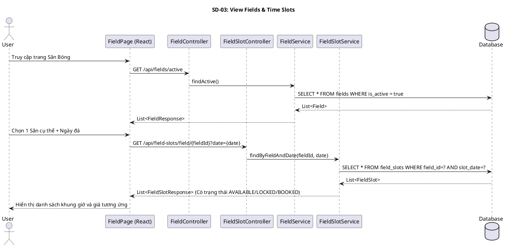
```plantuml
@startuml
title SD-03: View Fields & Time Slots
actor User
participant "FieldPage (React)" as FE
participant FieldController as FC
participant FieldSlotController as FSC
participant FieldService as FS
participant FieldSlotService as FSS
database Database as DB

User -> FE : Truy cập trang Sân Bóng
FE -> FC : GET /api/fields/active
FC -> FS : findActive()
FS -> DB : SELECT * FROM fields WHERE is_active = true
DB --> FS : List<Field>
FS --> FE : List<FieldResponse>

User -> FE : Chọn 1 Sân cụ thể + Ngày đá
FE -> FSC : GET /api/field-slots/field/{fieldId}?date={date}
FSC -> FSS : findByFieldAndDate(fieldId, date)
FSS -> DB : SELECT * FROM field_slots WHERE field_id=? AND slot_date=?
DB --> FSS : List<FieldSlot>
FSS --> FE : List<FieldSlotResponse> (Có trạng thái AVAILABLE/LOCKED/BOOKED)
FE --> User : Hiển thị danh sách khung giờ và giá tương ứng
@enduml
```

---

## 📝 3.3. Booking (Đặt Sân & Hủy Sân)
Khách đặt sân (tối đa 3 slot liên tiếp cùng sân), khóa giữ chỗ tạm thời 10 phút, hỗ trợ áp voucher và cho phép hủy sân theo chính sách hoàn tiền.

### 3.3.1. Mã Vẽ Class Diagram (PlantUML)
*Copy đoạn mã này vào [PlantText](https://www.planttext.com/) để vẽ:*
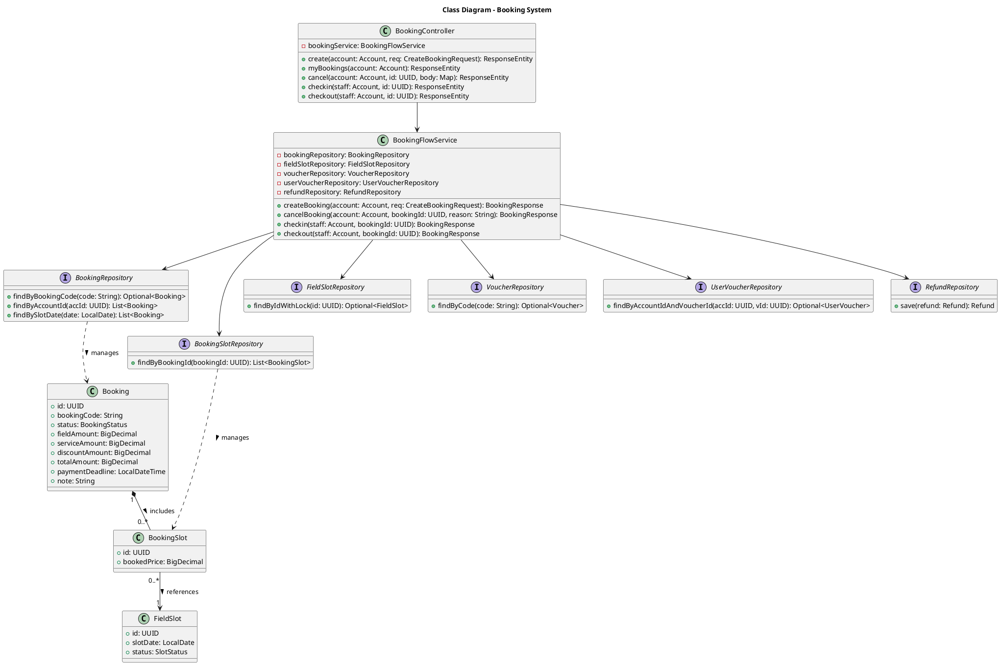
```plantuml
@startuml
title Class Diagram - Booking System

class BookingController {
    - bookingService: BookingFlowService
    + create(account: Account, req: CreateBookingRequest): ResponseEntity
    + myBookings(account: Account): ResponseEntity
    + cancel(account: Account, id: UUID, body: Map): ResponseEntity
    + checkin(staff: Account, id: UUID): ResponseEntity
    + checkout(staff: Account, id: UUID): ResponseEntity
}

class BookingFlowService {
    - bookingRepository: BookingRepository
    - fieldSlotRepository: FieldSlotRepository
    - voucherRepository: VoucherRepository
    - userVoucherRepository: UserVoucherRepository
    - refundRepository: RefundRepository
    + createBooking(account: Account, req: CreateBookingRequest): BookingResponse
    + cancelBooking(account: Account, bookingId: UUID, reason: String): BookingResponse
    + checkin(staff: Account, bookingId: UUID): BookingResponse
    + checkout(staff: Account, bookingId: UUID): BookingResponse
}

interface BookingRepository {
    + findByBookingCode(code: String): Optional<Booking>
    + findByAccountId(accId: UUID): List<Booking>
    + findBySlotDate(date: LocalDate): List<Booking>
}

interface BookingSlotRepository {
    + findByBookingId(bookingId: UUID): List<BookingSlot>
}

interface FieldSlotRepository {
    + findByIdWithLock(id: UUID): Optional<FieldSlot>
}

interface VoucherRepository {
    + findByCode(code: String): Optional<Voucher>
}

interface UserVoucherRepository {
    + findByAccountIdAndVoucherId(accId: UUID, vId: UUID): Optional<UserVoucher>
}

interface RefundRepository {
    + save(refund: Refund): Refund
}

class Booking {
    + id: UUID
    + bookingCode: String
    + status: BookingStatus
    + fieldAmount: BigDecimal
    + serviceAmount: BigDecimal
    + discountAmount: BigDecimal
    + totalAmount: BigDecimal
    + paymentDeadline: LocalDateTime
    + note: String
}

class BookingSlot {
    + id: UUID
    + bookedPrice: BigDecimal
}

class FieldSlot {
    + id: UUID
    + slotDate: LocalDate
    + status: SlotStatus
}

BookingController --> BookingFlowService

BookingFlowService --> BookingRepository
BookingFlowService --> BookingSlotRepository
BookingFlowService --> FieldSlotRepository
BookingFlowService --> VoucherRepository
BookingFlowService --> UserVoucherRepository
BookingFlowService --> RefundRepository

BookingRepository ..> Booking : manages >
BookingSlotRepository ..> BookingSlot : manages >

Booking "1" *-- "0..*" BookingSlot : includes >
BookingSlot "0..*" --> "1" FieldSlot : references >
@enduml
```

### 3.3.2. Sequence Diagram: Create Booking (Tạo Đơn Đặt Sân)
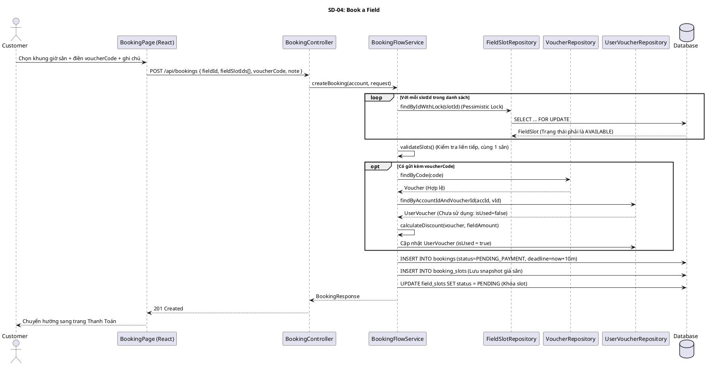
```plantuml
@startuml
title SD-04: Book a Field
actor Customer as C
participant "BookingPage (React)" as FE
participant BookingController as BC
participant BookingFlowService as BFS
participant FieldSlotRepository as FSR
participant VoucherRepository as VR
participant UserVoucherRepository as UVR
database Database as DB

C -> FE : Chọn khung giờ sân + điền voucherCode + ghi chú
FE -> BC : POST /api/bookings { fieldId, fieldSlotIds[], voucherCode, note }
BC -> BFS : createBooking(account, request)

loop Với mỗi slotId trong danh sách
  BFS -> FSR : findByIdWithLock(slotId) (Pessimistic Lock)
  FSR -> DB : SELECT ... FOR UPDATE
  DB --> FSR : FieldSlot (Trạng thái phải là AVAILABLE)
end

BFS -> BFS : validateSlots() (Kiểm tra liên tiếp, cùng 1 sân)

opt Có gửi kèm voucherCode
  BFS -> VR : findByCode(code)
  VR --> BFS : Voucher (Hợp lệ)
  BFS -> UVR : findByAccountIdAndVoucherId(accId, vId)
  UVR --> BFS : UserVoucher (Chưa sử dụng: isUsed=false)
  BFS -> BFS : calculateDiscount(voucher, fieldAmount)
  BFS -> UVR : Cập nhật UserVoucher (isUsed = true)
end

BFS -> DB : INSERT INTO bookings (status=PENDING_PAYMENT, deadline=now+10m)
BFS -> DB : INSERT INTO booking_slots (Lưu snapshot giá sân)
BFS -> DB : UPDATE field_slots SET status = PENDING (Khóa slot)
BFS --> BC : BookingResponse
BC --> FE : 201 Created
FE --> C : Chuyển hướng sang trang Thanh Toán
@enduml
```

### 3.3.3. Sequence Diagram: Cancel Booking (Hủy Đặt Sân)
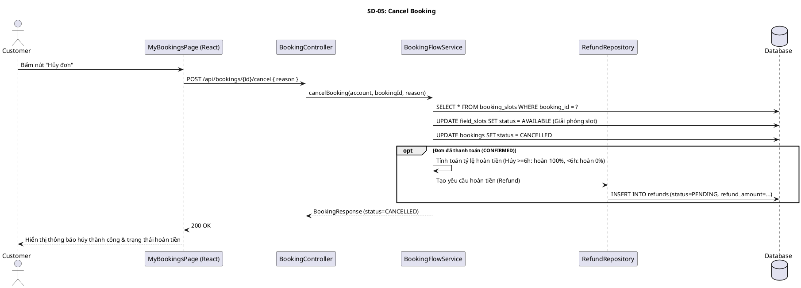
```plantuml
@startuml
title SD-05: Cancel Booking
actor Customer as C
participant "MyBookingsPage (React)" as FE
participant BookingController as BC
participant BookingFlowService as BFS
participant RefundRepository as RR
database Database as DB

C -> FE : Bấm nút "Hủy đơn"
FE -> BC : POST /api/bookings/{id}/cancel { reason }
BC -> BFS : cancelBooking(account, bookingId, reason)
BFS -> DB : SELECT * FROM booking_slots WHERE booking_id = ?
BFS -> DB : UPDATE field_slots SET status = AVAILABLE (Giải phóng slot)
BFS -> DB : UPDATE bookings SET status = CANCELLED

opt Đơn đã thanh toán (CONFIRMED)
  BFS -> BFS : Tính toán tỷ lệ hoàn tiền (Hủy >=6h: hoàn 100%, <6h: hoàn 0%)
  BFS -> RR : Tạo yêu cầu hoàn tiền (Refund)
  RR -> DB : INSERT INTO refunds (status=PENDING, refund_amount=...)
end

BFS --> BC : BookingResponse (status=CANCELLED)
BC --> FE : 200 OK
FE --> C : Hiển thị thông báo hủy thành công & trạng thái hoàn tiền
@enduml
```

---

## 🛒 3.4. Service & Cart (Dịch Vụ Đi Kèm & Giỏ Hàng)
Khách hàng có thể chọn nước uống, thuê bóng, áo bib vào giỏ hàng dịch vụ cá nhân, rồi tiến hành checkout lồng vào đơn đặt sân có sẵn.

### 3.4.1. Mã Vẽ Class Diagram (PlantUML)
*Copy đoạn mã này vào [PlantText](https://www.planttext.com/) để vẽ:*
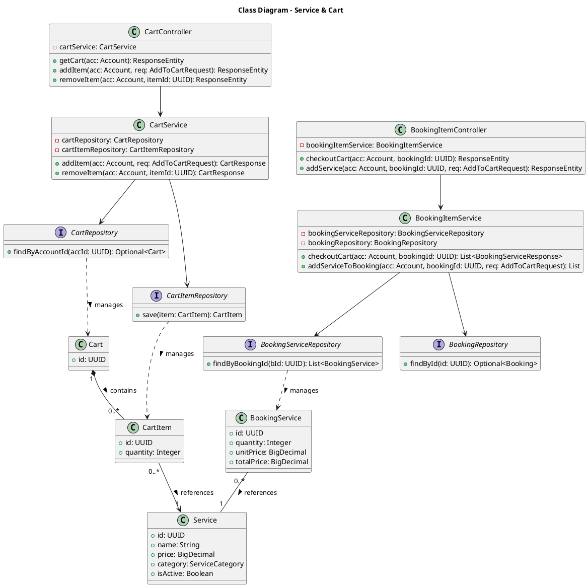
```plantuml
@startuml
title Class Diagram - Service & Cart

class CartController {
    - cartService: CartService
    + getCart(acc: Account): ResponseEntity
    + addItem(acc: Account, req: AddToCartRequest): ResponseEntity
    + removeItem(acc: Account, itemId: UUID): ResponseEntity
}

class BookingItemController {
    - bookingItemService: BookingItemService
    + checkoutCart(acc: Account, bookingId: UUID): ResponseEntity
    + addService(acc: Account, bookingId: UUID, req: AddToCartRequest): ResponseEntity
}

class CartService {
    - cartRepository: CartRepository
    - cartItemRepository: CartItemRepository
    + addItem(acc: Account, req: AddToCartRequest): CartResponse
    + removeItem(acc: Account, itemId: UUID): CartResponse
}

class BookingItemService {
    - bookingServiceRepository: BookingServiceRepository
    - bookingRepository: BookingRepository
    + checkoutCart(acc: Account, bookingId: UUID): List<BookingServiceResponse>
    + addServiceToBooking(acc: Account, bookingId: UUID, req: AddToCartRequest): List
}

interface CartRepository {
    + findByAccountId(accId: UUID): Optional<Cart>
}

interface CartItemRepository {
    + save(item: CartItem): CartItem
}

interface BookingServiceRepository {
    + findByBookingId(bId: UUID): List<BookingService>
}

interface BookingRepository {
    + findById(id: UUID): Optional<Booking>
}

class Service {
    + id: UUID
    + name: String
    + price: BigDecimal
    + category: ServiceCategory
    + isActive: Boolean
}

class Cart {
    + id: UUID
}

class CartItem {
    + id: UUID
    + quantity: Integer
}

class BookingService {
    + id: UUID
    + quantity: Integer
    + unitPrice: BigDecimal
    + totalPrice: BigDecimal
}

CartController --> CartService
BookingItemController --> BookingItemService

CartService --> CartRepository
CartService --> CartItemRepository
BookingItemService --> BookingServiceRepository
BookingItemService --> BookingRepository

CartRepository ..> Cart : manages >
CartItemRepository ..> CartItem : manages >
BookingServiceRepository ..> BookingService : manages >

Cart "1" *-- "0..*" CartItem : contains >
CartItem "0..*" --> "1" Service : references >
BookingService "0..*" -- "1" Service : references >
@enduml
```

### 3.4.2. Sequence Diagram: Add to Cart & Checkout Service (Đặt Dịch Vụ)
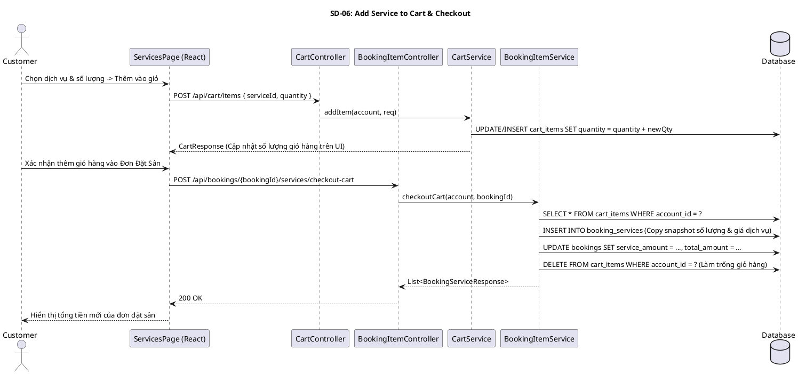
```plantuml
@startuml
title SD-06: Add Service to Cart & Checkout
actor Customer as C
participant "ServicesPage (React)" as FE
participant CartController as CC
participant BookingItemController as BIC
participant CartService as CS
participant BookingItemService as BIS
database Database as DB

C -> FE : Chọn dịch vụ & số lượng -> Thêm vào giỏ
FE -> CC : POST /api/cart/items { serviceId, quantity }
CC -> CS : addItem(account, req)
CS -> DB : UPDATE/INSERT cart_items SET quantity = quantity + newQty
CS --> FE : CartResponse (Cập nhật số lượng giỏ hàng trên UI)

C -> FE : Xác nhận thêm giỏ hàng vào Đơn Đặt Sân
FE -> BIC : POST /api/bookings/{bookingId}/services/checkout-cart
BIC -> BIS : checkoutCart(account, bookingId)
BIS -> DB : SELECT * FROM cart_items WHERE account_id = ?
BIS -> DB : INSERT INTO booking_services (Copy snapshot số lượng & giá dịch vụ)
BIS -> DB : UPDATE bookings SET service_amount = ..., total_amount = ...
BIS -> DB : DELETE FROM cart_items WHERE account_id = ? (Làm trống giỏ hàng)
BIS --> BIC : List<BookingServiceResponse>
BIC --> FE : 200 OK
FE --> C : Hiển thị tổng tiền mới của đơn đặt sân
@enduml
```

---

## 🎟️ 3.5. Voucher (Mã Giảm Giá)
IT_Admin phát hành mã giảm giá. Người dùng thu thập (Claim) voucher về ví cá nhân (sử dụng Khóa bi quan để chống tranh chấp khi số lượng có hạn).

### 3.5.1. Mã Vẽ Class Diagram (PlantUML)
*Copy đoạn mã này vào [PlantText](https://www.planttext.com/) để vẽ:*
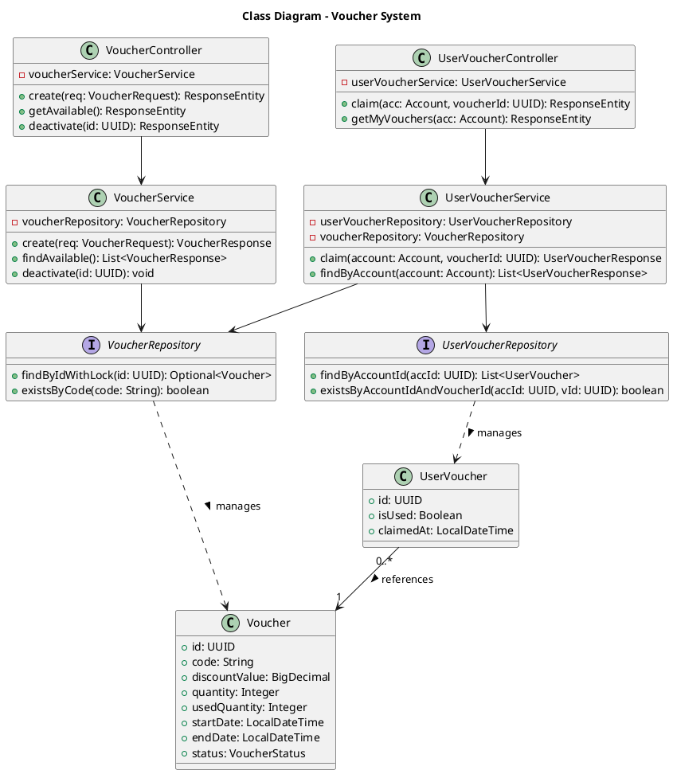
```plantuml
@startuml
title Class Diagram - Voucher System

class VoucherController {
    - voucherService: VoucherService
    + create(req: VoucherRequest): ResponseEntity
    + getAvailable(): ResponseEntity
    + deactivate(id: UUID): ResponseEntity
}

class UserVoucherController {
    - userVoucherService: UserVoucherService
    + claim(acc: Account, voucherId: UUID): ResponseEntity
    + getMyVouchers(acc: Account): ResponseEntity
}

class VoucherService {
    - voucherRepository: VoucherRepository
    + create(req: VoucherRequest): VoucherResponse
    + findAvailable(): List<VoucherResponse>
    + deactivate(id: UUID): void
}

class UserVoucherService {
    - userVoucherRepository: UserVoucherRepository
    - voucherRepository: VoucherRepository
    + claim(account: Account, voucherId: UUID): UserVoucherResponse
    + findByAccount(account: Account): List<UserVoucherResponse>
}

interface VoucherRepository {
    + findByIdWithLock(id: UUID): Optional<Voucher>
    + existsByCode(code: String): boolean
}

interface UserVoucherRepository {
    + findByAccountId(accId: UUID): List<UserVoucher>
    + existsByAccountIdAndVoucherId(accId: UUID, vId: UUID): boolean
}

class Voucher {
    + id: UUID
    + code: String
    + discountValue: BigDecimal
    + quantity: Integer
    + usedQuantity: Integer
    + startDate: LocalDateTime
    + endDate: LocalDateTime
    + status: VoucherStatus
}

class UserVoucher {
    + id: UUID
    + isUsed: Boolean
    + claimedAt: LocalDateTime
}

VoucherController --> VoucherService
UserVoucherController --> UserVoucherService

VoucherService --> VoucherRepository
UserVoucherService --> UserVoucherRepository
UserVoucherService --> VoucherRepository

VoucherRepository ..> Voucher : manages >
UserVoucherRepository ..> UserVoucher : manages >

UserVoucher "0..*" --> "1" Voucher : references >
@enduml
```

### 3.5.2. Sequence Diagram: Claim Voucher (Nhận Mã Giảm Giá)
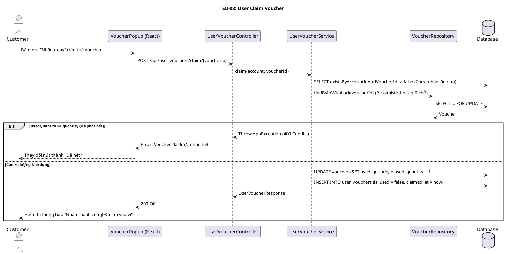
```plantuml
@startuml
title SD-08: User Claim Voucher
actor Customer as C
participant "VoucherPopup (React)" as FE
participant UserVoucherController as UVC
participant UserVoucherService as UVS
participant VoucherRepository as VR
database Database as DB

C -> FE : Bấm nút "Nhận ngay" trên thẻ Voucher
FE -> UVC : POST /api/user-vouchers/claim/{voucherId}
UVC -> UVS : claim(account, voucherId)
UVS -> DB : SELECT existsByAccountIdAndVoucherId -> false (Chưa nhận lần nào)

UVS -> VR : findByIdWithLock(voucherId) (Pessimistic Lock giữ chỗ)
VR -> DB : SELECT ... FOR UPDATE
DB --> VR : Voucher

alt usedQuantity >= quantity (Đã phát hết)
  UVS --> UVC : Throw AppException (409 Conflict)
  UVC --> FE : Error: Voucher đã được nhận hết
  FE --> C : Thay đổi nút thành "Đã hết"
else Còn số lượng khả dụng
  UVS -> DB : UPDATE vouchers SET used_quantity = used_quantity + 1
  UVS -> DB : INSERT INTO user_vouchers (is_used = false, claimed_at = now)
  UVS --> UVC : UserVoucherResponse
  UVC --> FE : 200 OK
  FE --> C : Hiển thị thông báo "Nhận thành công! Đã lưu vào ví"
end
@enduml
```

---

## 💳 3.6. Payment (Thanh Toán Qua Cổng VNPay)
Luồng thanh toán đặt sân. Hệ thống sinh URL VNPay động, điều hướng người dùng, xác thực tính toàn vẹn giao dịch và xác nhận chính thức qua kênh ngầm IPN.

### 3.6.1. Mã Vẽ Class Diagram (PlantUML)
*Copy đoạn mã này vào [PlantText](https://www.planttext.com/) để vẽ:*
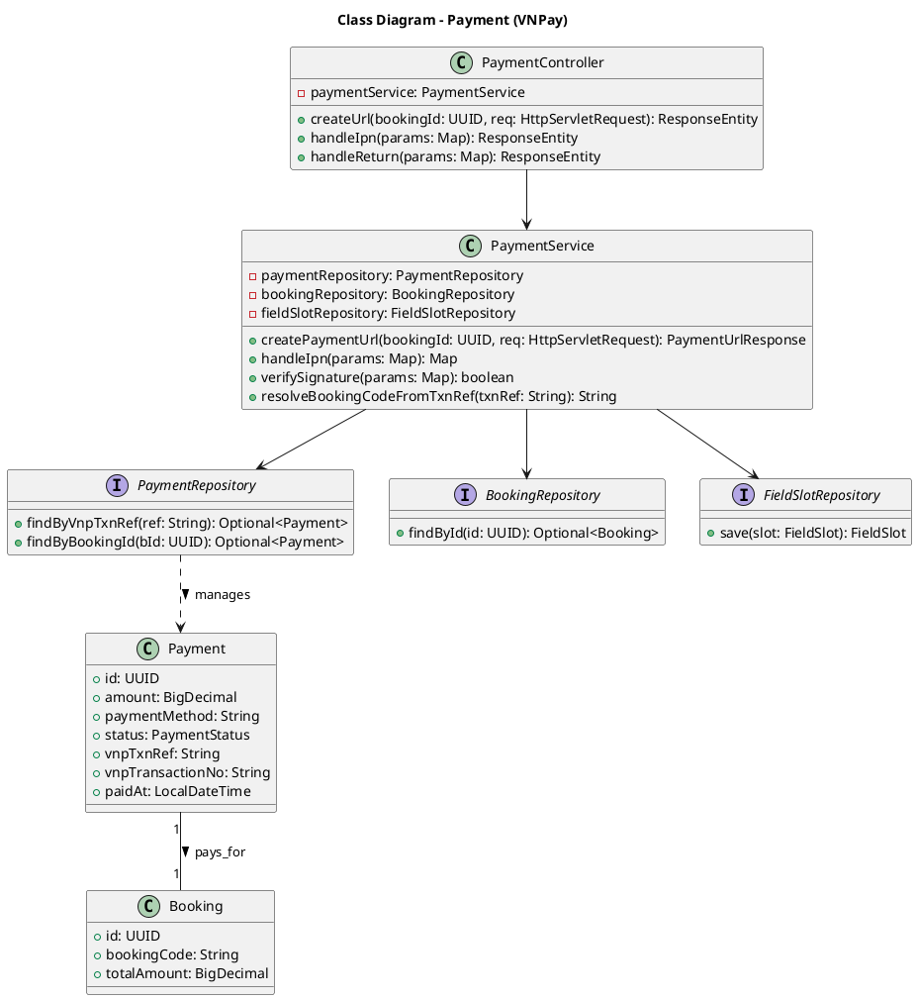
```plantuml
@startuml
title Class Diagram - Payment (VNPay)

class PaymentController {
    - paymentService: PaymentService
    + createUrl(bookingId: UUID, req: HttpServletRequest): ResponseEntity
    + handleIpn(params: Map): ResponseEntity
    + handleReturn(params: Map): ResponseEntity
}

class PaymentService {
    - paymentRepository: PaymentRepository
    - bookingRepository: BookingRepository
    - fieldSlotRepository: FieldSlotRepository
    + createPaymentUrl(bookingId: UUID, req: HttpServletRequest): PaymentUrlResponse
    + handleIpn(params: Map): Map
    + verifySignature(params: Map): boolean
    + resolveBookingCodeFromTxnRef(txnRef: String): String
}

interface PaymentRepository {
    + findByVnpTxnRef(ref: String): Optional<Payment>
    + findByBookingId(bId: UUID): Optional<Payment>
}

interface BookingRepository {
    + findById(id: UUID): Optional<Booking>
}

interface FieldSlotRepository {
    + save(slot: FieldSlot): FieldSlot
}

class Payment {
    + id: UUID
    + amount: BigDecimal
    + paymentMethod: String
    + status: PaymentStatus
    + vnpTxnRef: String
    + vnpTransactionNo: String
    + paidAt: LocalDateTime
}

class Booking {
    + id: UUID
    + bookingCode: String
    + totalAmount: BigDecimal
}

PaymentController --> PaymentService
PaymentService --> PaymentRepository
PaymentService --> BookingRepository
PaymentService --> FieldSlotRepository

PaymentRepository ..> Payment : manages >
Payment "1" -- "1" Booking : pays_for >
@enduml
```

### 3.6.2. Sequence Diagram: Payment via VNPay (Thanh Toán)
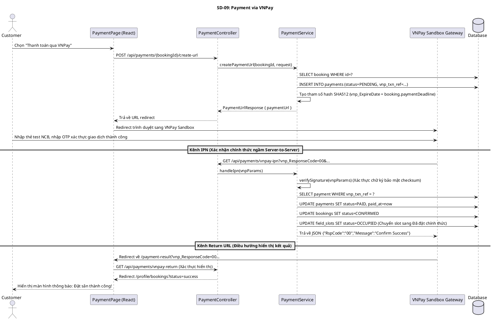
```plantuml
@startuml
title SD-09: Payment via VNPay
actor Customer as C
participant "PaymentPage (React)" as FE
participant PaymentController as PC
participant PaymentService as PS
participant "VNPay Sandbox Gateway" as VNP
database Database as DB

C -> FE : Chọn "Thanh toán qua VNPay"
FE -> PC : POST /api/payments/{bookingId}/create-url
PC -> PS : createPaymentUrl(bookingId, request)
PS -> DB : SELECT booking WHERE id=?
PS -> DB : INSERT INTO payments (status=PENDING, vnp_txn_ref=...)
PS -> PS : Tạo tham số hash SHA512 (vnp_ExpireDate = booking.paymentDeadline)
PS --> PC : PaymentUrlResponse { paymentUrl }
PC --> FE : Trả về URL redirect
FE -> VNP : Redirect trình duyệt sang VNPay Sandbox
C -> VNP : Nhập thẻ test NCB, nhập OTP xác thực giao dịch thành công

== Kênh IPN (Xác nhận chính thức ngầm Server-to-Server) ==
VNP -> PC : GET /api/payments/vnpay-ipn?vnp_ResponseCode=00&...
PC -> PS : handleIpn(vnpParams)
PS -> PS : verifySignature(vnpParams) (Xác thực chữ ký bảo mật checksum)
PS -> DB : SELECT payment WHERE vnp_txn_ref = ?
PS -> DB : UPDATE payments SET status=PAID, paid_at=now
PS -> DB : UPDATE bookings SET status=CONFIRMED
PS -> DB : UPDATE field_slots SET status=OCCUPIED (Chuyển slot sang Đã đặt chính thức)
PS --> VNP : Trả về JSON {"RspCode":"00","Message":"Confirm Success"}

== Kênh Return URL (Điều hướng hiển thị kết quả) ==
VNP -> FE : Redirect về /payment-result?vnp_ResponseCode=00...
FE -> PC : GET /api/payments/vnpay-return (Xác thực hiển thị)
PC --> FE : Redirect /profile/bookings?status=success
FE --> C : Hiển thị màn hình thông báo: Đặt sân thành công!
@enduml
```

---

## ⏰ 3.7. Check-in, Check-out & Refund (Check-in, Check-out & Hoàn Tiền)
Quy trình Check-in/Check-out của khách tại sân và quy trình xử lý duyệt hoàn tiền thủ công cho các đơn đặt sân bị hủy.

### 3.7.1. Mã Vẽ Class Diagram (PlantUML)
*Copy đoạn mã này vào [PlantText](https://www.planttext.com/) để vẽ:*
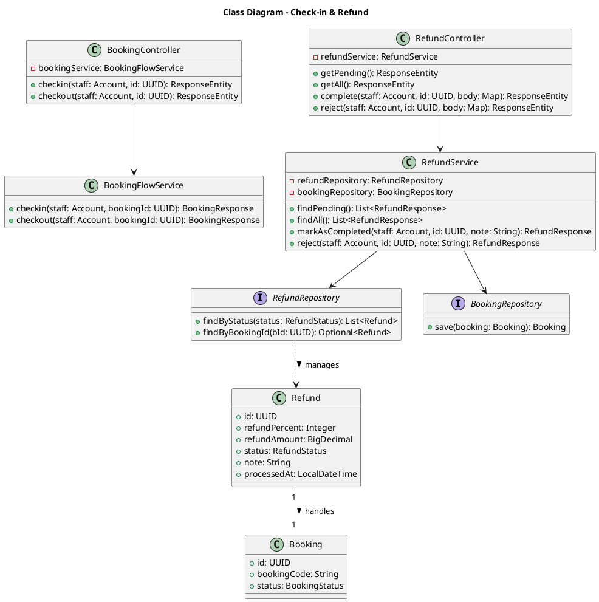
```plantuml
@startuml
title Class Diagram - Check-in & Refund

class BookingController {
    - bookingService: BookingFlowService
    + checkin(staff: Account, id: UUID): ResponseEntity
    + checkout(staff: Account, id: UUID): ResponseEntity
}

class RefundController {
    - refundService: RefundService
    + getPending(): ResponseEntity
    + getAll(): ResponseEntity
    + complete(staff: Account, id: UUID, body: Map): ResponseEntity
    + reject(staff: Account, id: UUID, body: Map): ResponseEntity
}

class BookingFlowService {
    + checkin(staff: Account, bookingId: UUID): BookingResponse
    + checkout(staff: Account, bookingId: UUID): BookingResponse
}

class RefundService {
    - refundRepository: RefundRepository
    - bookingRepository: BookingRepository
    + findPending(): List<RefundResponse>
    + findAll(): List<RefundResponse>
    + markAsCompleted(staff: Account, id: UUID, note: String): RefundResponse
    + reject(staff: Account, id: UUID, note: String): RefundResponse
}

interface RefundRepository {
    + findByStatus(status: RefundStatus): List<Refund>
    + findByBookingId(bId: UUID): Optional<Refund>
}

interface BookingRepository {
    + save(booking: Booking): Booking
}

class Refund {
    + id: UUID
    + refundPercent: Integer
    + refundAmount: BigDecimal
    + status: RefundStatus
    + note: String
    + processedAt: LocalDateTime
}

class Booking {
    + id: UUID
    + bookingCode: String
    + status: BookingStatus
}

BookingController --> BookingFlowService
RefundController --> RefundService

RefundService --> RefundRepository
RefundService --> BookingRepository

RefundRepository ..> Refund : manages >
Refund "1" -- "1" Booking : handles >
@enduml
```

### 3.7.2. Sequence Diagram: Check-in (Nhận Sân)
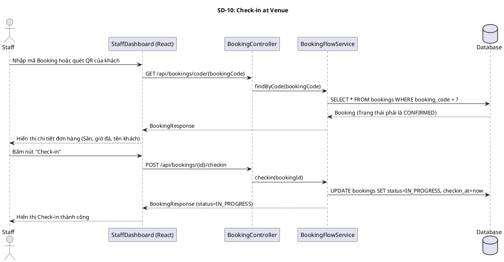
```plantuml
@startuml
title SD-10: Check-in at Venue
actor Staff
participant "StaffDashboard (React)" as FE
participant BookingController as BC
participant BookingFlowService as BFS
database Database as DB

Staff -> FE : Nhập mã Booking hoặc quét QR của khách
FE -> BC : GET /api/bookings/code/{bookingCode}
BC -> BFS : findByCode(bookingCode)
BFS -> DB : SELECT * FROM bookings WHERE booking_code = ?
DB --> BFS : Booking (Trạng thái phải là CONFIRMED)
BFS --> FE : BookingResponse
FE --> Staff : Hiển thị chi tiết đơn hàng (Sân, giờ đá, tên khách)

Staff -> FE : Bấm nút "Check-in"
FE -> BC : POST /api/bookings/{id}/checkin
BC -> BFS : checkin(bookingId)
BFS -> DB : UPDATE bookings SET status=IN_PROGRESS, checkin_at=now
BFS --> FE : BookingResponse (status=IN_PROGRESS)
FE --> Staff : Hiển thị Check-in thành công
@enduml
```

### 3.7.3. Sequence Diagram: Check-out & Refund (Trả Sân & Hoàn Tiền)
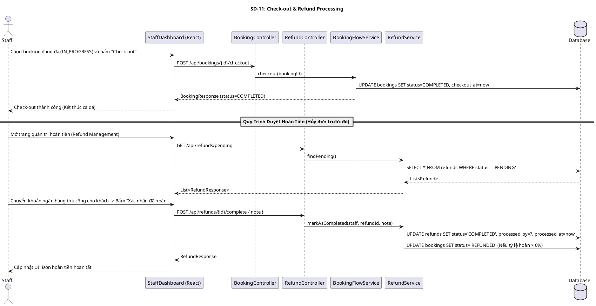
```plantuml
@startuml
title SD-11: Check-out & Refund Processing
actor Staff
participant "StaffDashboard (React)" as FE
participant BookingController as BC
participant RefundController as RC
participant BookingFlowService as BFS
participant RefundService as RS
database Database as DB

Staff -> FE : Chọn booking đang đá (IN_PROGRESS) và bấm "Check-out"
FE -> BC : POST /api/bookings/{id}/checkout
BC -> BFS : checkout(bookingId)
BFS -> DB : UPDATE bookings SET status=COMPLETED, checkout_at=now
BFS --> FE : BookingResponse (status=COMPLETED)
FE --> Staff : Check-out thành công (Kết thúc ca đá)

== Quy Trình Duyệt Hoàn Tiền (Hủy đơn trước đó) ==
Staff -> FE : Mở trang quản trị hoàn tiền (Refund Management)
FE -> RC : GET /api/refunds/pending
RC -> RS : findPending()
RS -> DB : SELECT * FROM refunds WHERE status = 'PENDING'
DB --> RS : List<Refund>
RS --> FE : List<RefundResponse>

Staff -> FE : Chuyển khoản ngân hàng thủ công cho khách -> Bấm "Xác nhận đã hoàn"
FE -> RC : POST /api/refunds/{id}/complete { note }
RC -> RS : markAsCompleted(staff, refundId, note)
RS -> DB : UPDATE refunds SET status='COMPLETED', processed_by=?, processed_at=now
RS -> DB : UPDATE bookings SET status='REFUNDED' (Nếu tỷ lệ hoàn > 0%)
RS --> FE : RefundResponse
FE --> Staff : Cập nhật UI: Đơn hoàn tiền hoàn tất
@enduml
```

---

## 📊 3.8. Owner Dashboard (Báo Cáo Thống Kê Doanh Thu)
Báo cáo số liệu tài chính trực quan, tỷ lệ đặt sân lấp đầy và biểu đồ tăng trưởng cho Chủ sân (Owner) và Admin hệ thống.

### 3.8.1. Mã Vẽ Class Diagram (PlantUML)
*Copy đoạn mã này vào [PlantText](https://www.planttext.com/) để vẽ:*
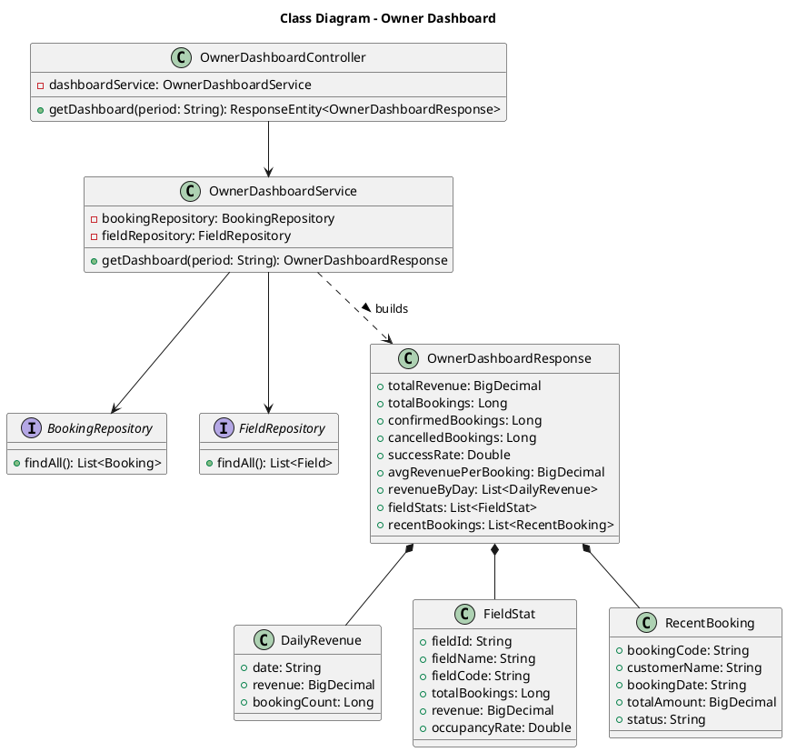
```plantuml
@startuml
title Class Diagram - Owner Dashboard

class OwnerDashboardController {
    - dashboardService: OwnerDashboardService
    + getDashboard(period: String): ResponseEntity<OwnerDashboardResponse>
}

class OwnerDashboardService {
    - bookingRepository: BookingRepository
    - fieldRepository: FieldRepository
    + getDashboard(period: String): OwnerDashboardResponse
}

interface BookingRepository {
    + findAll(): List<Booking>
}

interface FieldRepository {
    + findAll(): List<Field>
}

class OwnerDashboardResponse {
    + totalRevenue: BigDecimal
    + totalBookings: Long
    + confirmedBookings: Long
    + cancelledBookings: Long
    + successRate: Double
    + avgRevenuePerBooking: BigDecimal
    + revenueByDay: List<DailyRevenue>
    + fieldStats: List<FieldStat>
    + recentBookings: List<RecentBooking>
}

class DailyRevenue {
    + date: String
    + revenue: BigDecimal
    + bookingCount: Long
}

class FieldStat {
    + fieldId: String
    + fieldName: String
    + fieldCode: String
    + totalBookings: Long
    + revenue: BigDecimal
    + occupancyRate: Double
}

class RecentBooking {
    + bookingCode: String
    + customerName: String
    + bookingDate: String
    + totalAmount: BigDecimal
    + status: String
}

OwnerDashboardController --> OwnerDashboardService
OwnerDashboardService --> BookingRepository
OwnerDashboardService --> FieldRepository

OwnerDashboardService ..> OwnerDashboardResponse : builds >
OwnerDashboardResponse *-- DailyRevenue
OwnerDashboardResponse *-- FieldStat
OwnerDashboardResponse *-- RecentBooking
@enduml
```

### 3.8.2. Sequence Diagram: View Dashboard (Xem Báo Cáo)
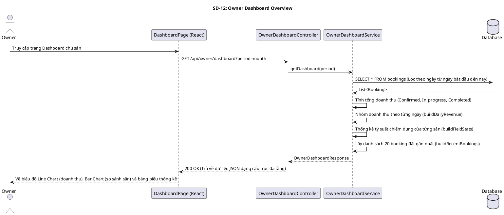
```plantuml
@startuml
title SD-12: Owner Dashboard Overview
actor Owner
participant "DashboardPage (React)" as FE
participant OwnerDashboardController as ODC
participant OwnerDashboardService as ODS
database Database as DB

Owner -> FE : Truy cập trang Dashboard chủ sân
FE -> ODC : GET /api/owner/dashboard?period=month
ODC -> ODS : getDashboard(period)

ODS -> DB : SELECT * FROM bookings (Lọc theo ngày từ ngày bắt đầu đến nay)
DB --> ODS : List<Booking>

ODS -> ODS : Tính tổng doanh thu (Confirmed, In_progress, Completed)
ODS -> ODS : Nhóm doanh thu theo từng ngày (buildDailyRevenue)
ODS -> ODS : Thống kê tỷ suất chiếm dụng của từng sân (buildFieldStats)
ODS -> ODS : Lấy danh sách 20 booking đặt gần nhất (buildRecentBookings)

ODS --> ODC : OwnerDashboardResponse
ODC --> FE : 200 OK (Trả về dữ liệu JSON dạng cấu trúc đa tầng)
FE --> Owner : Vẽ biểu đồ Line Chart (doanh thu), Bar Chart (so sánh sân) và bảng biểu thống kê
@enduml
```
