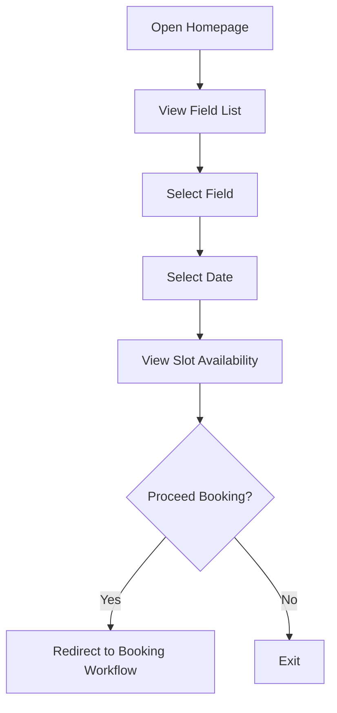
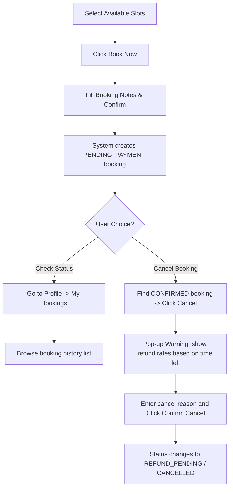
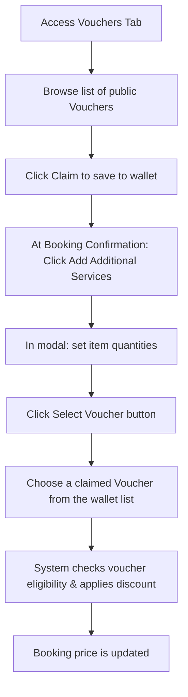

# 3. USER MANUAL

This section provides detailed guides for end-users to operate the **FFZone** soccer field booking system. It describes the workflows for browsing fields, managing bookings, and selecting additional services and vouchers.

---

## 3.1 Overview
The user manual serves as a step-by-step guide for customers to navigate the application, make reservations, check history, and manage add-on items.

---

## 3.2 Workflow 1: Football Field Browsing

### [Describe the purpose of this workflow, draw workflow diagram and other relevant diagrams]

#### 3.2.1. Purpose
The purpose of this workflow is to allow Guests and Users to browse football fields, view field information, check slot availability, and decide whether to proceed with a booking.
This workflow helps customers quickly find suitable football fields by providing field details, pricing information, additional services, and available booking slots.

#### 3.2.2. Workflow Diagram
* **Actors**:
  * Guest / User
  * FFZONE System
  * Staff (Background)
  * Owner / IT Admin (Background)

* **Business Flow Diagram**:

* **Detailed Workflow Description**:
  | Step | User Action | System Response |
  | :--- | :--- | :--- |
  | 1 | Open Homepage | Load homepage |
  | 2 | View Field List | Display active fields |
  | 3 | Select Field | Load field details |
  | 4 | Select Date | Validate booking window |
  | 5 | View Slot Availability | Display slot status |
  | 6 | Proceed Booking | Redirect to booking workflow |

#### 3.2.3. Actor Responsibilities
* **Guest / User**:
  * Access homepage.
  * Browse football fields.
  * View field details.
  * Check available slots.
  * Decide whether to continue booking.
* **Staff (Background)**:
  * Maintain field availability status.
  * Update maintenance status when necessary.
  * Support customers with field information.
* **Owner / IT Admin (Background)**:
  * Manage field information.
  * Configure field pricing.
  * Manage services and images.
  * Maintain field availability data.
* **FFZONE System**:
  * Display active football fields.
  * Filter out fields under maintenance.
  * Validate booking dates.
  * Load slot availability.
  * Display slot status.

---

### [Describe the detailed guides for the workflow by providing the brief description, step by step guides (attached with user interface) of how to use that function]

#### 3.2.4. Detailed Workflow Guide

* **Step 1: Open Homepage**
  * **Description**: The user accesses the FFZONE CENTER website.
  * **System Processing**:
    * Load homepage.
    * Display featured football fields.
    * Display navigation menu.
  * **UI Attachment**:
    > **[SCREENSHOT: Capture the Homepage / Landing Page showing navigation and featured content]**

* **Step 2: View Field List**
  * **Description**: The user opens the football field list page.
  * **System Processing**:
    * Retrieve active football fields.
    * Exclude fields with MAINTENANCE status.
    * Display available fields.
  * **UI Attachment**:
    > **[SCREENSHOT: Capture the Fields Listing Page with name search bar and size filters]**
  * **Related Business Rules**:
    * `BR-18` Maintenance Filtering

* **Step 3: Select a Field**
  * **Description**: The user selects a football field to view detailed information.
  * **System Processing**:
    * Load selected field information.
    * Load images.
    * Load pricing information.
    * Load available services.
  * **UI Attachment**:
    > **[SCREENSHOT: Capture the Field Details Page showing descriptions, gallery, and pricing]**
  * **Related Use Cases**:
    * `UC03` View Field Details

* **Step 4: Select Booking Date**
  * **Description**: The user selects a date to check field availability.
  * **System Processing**:
    * Validate selected date.
    * Verify date is not in the past.
    * Verify date is within the next 7 days.
  * **UI Attachment**:
    > **[SCREENSHOT: Capture the Calendar Date Selection interface on the details page]**
  * **Related Business Rules**:
    * `BR-15` Booking Window
    * `BR-16` Past Time Restriction

* **Step 5: View Slot Availability**
  * **Description**: The system displays available slots for the selected date.
  * **System Processing**:
    * Retrieve slot records.
    * Retrieve slot status.
    * Display slot availability.
  * **UI Attachment**:
    > **[SCREENSHOT: Capture the Time Slot Grid showing green "Available" and red/gray "Occupied" slots]**
  * **Related Business Rules**:
    * `BR-14` Slot Status Display

* **Step 6: Decide to Proceed Booking**
  * **Description**: The user decides whether to continue with the booking process.
  * **Alternative Flows**:
    * **Option 1: Continue Booking**: System redirects the user to Booking Workflow.
    * **Option 2: Exit**: Workflow ends.
  * **UI Attachment**:
    > **[SCREENSHOT: Capture the "Book Now" confirmation overlay or button action]**

#### 3.2.5. Related Use Cases
* `UC01` View Home Page
* `UC02` View Field List
* `UC03` View Field Details
* `UC05` View Available Slots

#### 3.2.6. Related Business Rules
* `BR-01` Guest Access Restriction
* `BR-14` Slot Status Display
* `BR-15` Booking Window
* `BR-16` Past Time Restriction
* `BR-18` Maintenance Filtering

---
---

## 3.3 Workflow 2: Booking Management

### [Describe the purpose of this workflow, draw workflow diagram and other relevant diagrams]

#### 3.3.1. Purpose
The purpose of this workflow is to allow registered Customers to make football field reservations (bookings), view their historical booking orders, track booking statuses (Pending Payment, Confirmed, Completed, Cancelled, Refunded), and request booking cancellations with automatic refund rate calculations according to the system policy.

#### 3.3.2. Workflow Diagram
* **Actors**:
  * Guest / User (Customer)
  * FFZONE System
  * Staff (Background)
  * Owner / IT Admin (Background)

* **Business Flow Diagram**:

* **Detailed Workflow Description**:
  | Step | User Action | System Response |
  | :--- | :--- | :--- |
  | 1 | Click "Book Now" on selected slots | Redirect to Booking Confirmation Page |
  | 2 | Fill booking notes and click "Confirm Booking" | Create booking with PENDING_PAYMENT status and start countdown timer |
  | 3 | Access "My Bookings" page | Display list of user's past and active bookings |
  | 4 | Click "Cancel" on a CONFIRMED booking | Display cancellation modal with refund details based on policy |
  | 5 | Enter cancel reason and confirm cancellation | Update status to REFUND_PENDING and notify staff |

#### 3.3.3. Actor Responsibilities
* **Guest / User (Customer)**:
  * Select target time slots and initiate booking.
  * Enter booking notes and confirm reservation.
  * Monitor booking status in personal history.
  * Request booking cancellation and provide reasons.
* **Staff (Background)**:
  * Review and approve/reject cancellation and refund requests.
  * Support customers with manual check-in or booking adjustments at the venue.
* **Owner / IT Admin (Background)**:
  * Set database configurations for cancellation periods and refund policies.
  * Track booking metrics and overall payment logs.
* **FFZONE System**:
  * Create booking invoices and manage transaction timers.
  * Fetch user booking records and enable filter tabs.
  * Calculate elapsed time before kick-off and automatically compute refund rates during cancellation.
  * Handle slot state transitions (releasing slots on cancellation).

---

### [Describe the detailed guides for the workflow by providing the brief description, step by step guides (attached with user interface) of how to use that function]

#### 3.3.4. Detailed Workflow Guide

* **Step 1: Initiate Booking**
  * **Description**: The user selects slots on the details page and initiates a booking.
  * **System Processing**:
    * Check slot availability status.
    * Group chosen slots.
    * Redirect to Booking Confirmation page.
  * **UI Attachment**:
    > **[SCREENSHOT: Capture the Booking Confirmation Page displaying selected slots and details]**
  * **Related Use Cases**:
    * `UC09` Book Football Field

* **Step 2: Confirm Reservation**
  * **Description**: The user confirms the booking request.
  * **System Processing**:
    * Save booking record.
    * Set booking status to PENDING_PAYMENT.
    * Set slot status to PENDING.
    * Initiate a 15-minute checkout countdown timer.
  * **UI Attachment**:
    > **[SCREENSHOT: Capture the Checkout Screen showing PENDING_PAYMENT status and payment countdown]**
  * **Related Business Rules**:
    * `BR-26` Reservation Timeout
    * `BR-27` Double Booking Prevention

* **Step 3: View Booking History**
  * **Description**: The user views their history list.
  * **System Processing**:
    * Retrieve bookings matching the logged-in User ID.
    * Display bookings sorted by date.
    * Enable tab filters (All, Pending, Confirmed, Cancelled, Refunded).
  * **UI Attachment**:
    > **[SCREENSHOT: Capture the My Bookings Page showing list of transactions and filter tabs]**
  * **Related Use Cases**:
    * `UC13` View Booking History

* **Step 4: Request Booking Cancellation**
  * **Description**: The user cancels an active reservation.
  * **System Processing**:
    * Verify the booking status is `CONFIRMED` or `PENDING_PAYMENT`.
    * Calculate the hours remaining before the check-in time.
    * Apply the refund rules:
      * Cancellation > 24 hours: 100% refund.
      * Cancellation 12 to 24 hours: 50% refund.
      * Cancellation < 12 hours: 0% refund.
    * Display the calculated refund rate.
  * **UI Attachment**:
    > **[SCREENSHOT: Capture the Cancellation Dialog modal displaying refund rules warning and reason field]**
  * **Related Use Cases**:
    * `UC14` Cancel Booking
  * **Related Business Rules**:
    * `BR-51` Refund Policy Window
    * `BR-52` Cancellation Rules

* **Step 5: Confirm Cancellation**
  * **Description**: The user enters the cancellation reason and confirms the cancellation request.
  * **System Processing**:
    * Update booking status to `REFUND_PENDING` (or `CANCELLED` if unpaid).
    * Create a refund record in the database.
    * Release the booked slots back to `AVAILABLE`.
    * Send notification to staff.
  * **UI Attachment**:
    > **[SCREENSHOT: Capture the Booking Detail page showing the updated REFUND_PENDING status]**
  * **Related Use Cases**:
    * `UC14` Cancel Booking
  * **Related Business Rules**:
    * `BR-80` Slot Release on Cancellation

#### 3.3.5. Related Use Cases
* `UC09` Book Football Field
* `UC13` View Booking History
* `UC14` Cancel Booking

#### 3.3.6. Related Business Rules
* `BR-26` Reservation Timeout
* `BR-27` Double Booking Prevention
* `BR-28` User Booking Limit
* `BR-51` Refund Policy Window
* `BR-52` Cancellation Rules
* `BR-53` Past Booking Restriction
* `BR-54` Gaps Verification
* `BR-55` Slot Overlap Restriction
* `BR-56` Active Voucher Release
* `BR-75` Booking Status Change
* `BR-80` Slot Release on Cancellation

---
---

## 3.4 Workflow 3: Service & Voucher Management

### [Describe the purpose of this workflow, draw workflow diagram and other relevant diagrams]

#### 3.4.1. Purpose
The purpose of this workflow is to allow customers to order additional rental services (beverages, equipment hire like bibs or training balls) during booking creation and claim/apply promotional vouchers to reduce the total payment amount.

#### 3.4.2. Workflow Diagram
* **Actors**:
  * Guest / User (Customer)
  * FFZONE System
  * Owner / IT Admin (Background)

* **Business Flow Diagram**:

* **Detailed Workflow Description**:
  | Step | User Action | System Response |
  | :--- | :--- | :--- |
  | 1 | Visit Vouchers page | Display list of available promotional vouchers |
  | 2 | Click "Claim" on a voucher card | Add the voucher code to the user's account wallet |
  | 3 | Click "Add Additional Services" on booking screen | Open selection modal showing active services by category |
  | 4 | Adjust service item quantities and click Done | Update booking summary with service list and amount |
  | 5 | Click "Select Voucher" and choose an active voucher | Verify voucher conditions and apply price discount |

#### 3.4.3. Actor Responsibilities
* **Guest / User (Customer)**:
  * Browse available promotional events.
  * Collect vouchers to their personal profile wallet.
  * Select matchday services (water, sports bibs, etc.) and specify quantities.
  * Apply active vouchers to lower booking totals at checkout.
* **Owner / IT Admin (Background)**:
  * Manage services catalogue (pricing, categories, images, and inventory).
  * Configure voucher policies (discount metrics, usage caps, and validity dates).
* **FFZONE System**:
  * Display active vouchers and services.
  * Validate voucher eligibility against booking criteria.
  * Apply discount calculations (fixed rate or percentage caps) to the booking billing totals.

---

### [Describe the detailed guides for the workflow by providing the brief description, step by step guides (attached with user interface) of how to use that function]

#### 3.4.4. Detailed Workflow Guide

* **Step 1: Browse and Claim Vouchers**
  * **Description**: The user browses public vouchers and saves them to their profile.
  * **System Processing**:
    * Retrieve active vouchers with start dates before today and end dates after today.
    * Check if user has already claimed the voucher.
    * Save user voucher record when user clicks "Claim".
  * **UI Attachment**:
    > **[SCREENSHOT: Capture the Vouchers Listing page displaying promo cards and Claim buttons]**
  * **Related Use Cases**:
    * `UC16` View Available Vouchers

* **Step 2: Add Additional Services**
  * **Description**: The user opens the service catalog modal and selects items.
  * **System Processing**:
    * Retrieve active services list.
    * Categorize services: DRINK, EQUIPMENT, FACILITY.
    * Display quantity inputs.
  * **UI Attachment**:
    > **[SCREENSHOT: Capture the Add Services Modal overlay showing categorizations and quantity counters]**
  * **Related Use Cases**:
    * `UC10` Select Additional Services
  * **Related Business Rules**:
    * `BR-31` Active Services Only
    * `BR-32` Quantity Limits

* **Step 3: Confirm Services Selection**
  * **Description**: The user confirms the services they want to order.
  * **System Processing**:
    * Calculate `Service Amount = Sum(Service Price * Quantity)`.
    * Update the booking preview item list and final total.
  * **UI Attachment**:
    > **[SCREENSHOT: Capture the Booking Summary panel showing listed services and updated total price]**
  * **Related Use Cases**:
    * `UC10` Select Additional Services

* **Step 4: Select and Apply Voucher**
  * **Description**: The user chooses a voucher to apply to their booking order.
  * **System Processing**:
    * Retrieve claimed unused vouchers for the user's account.
    * Check if booking total meets the voucher's minimum order requirement.
    * Calculate discount value:
      * Fixed amount: discount equals fixed value.
      * Percentage: discount equals `Percentage * Booking Amount` (capped at max limit).
    * Subtract discount from total order amount.
  * **UI Attachment**:
    > **[SCREENSHOT: Capture the Voucher Selection Modal popup showing user's claimed vouchers list]**
  * **Related Use Cases**:
    * `UC11` Apply Voucher
  * **Related Business Rules**:
    * `BR-35` Voucher Expiration Check
    * `BR-36` Minimum Order Requirement
    * `BR-37` Voucher Double Use Prevention
    * `BR-76` Active Voucher Constraint

#### 3.4.5. Related Use Cases
* `UC10` Select Additional Services
* `UC11` Apply Voucher
* `UC16` View Available Vouchers

#### 3.4.6. Related Business Rules
* `BR-31` Active Services Only
* `BR-32` Quantity Limits
* `BR-33` Service Stock Availability
* `BR-34` Voucher Eligibility Verification
* `BR-35` Voucher Expiration Check
* `BR-36` Minimum Order Requirement
* `BR-37` Voucher Double Use Prevention
* `BR-38` Single Voucher per Booking Limit
* `BR-39` Maximum Discount Limit
* `BR-40` Voucher Quantity Limit
* `BR-41` Exceeded Usage Limit Handling
* `BR-42` Role-Based Voucher Access
* `BR-76` Active Voucher Constraint
